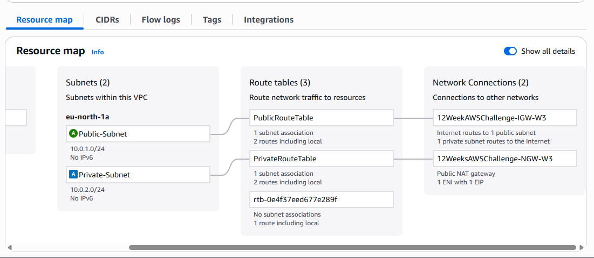

# 12WeeksAWSChallenge-Week2-compute
Week 2 of 12 Weeks of AWS Challenge: Deploying a scalable frontend-backend architecture using AWS Elastic Beanstalk with proper networking, private/public subnets, and multi-tier deployment."
Absolutely! Here's a **summarized and polished version** of your README with a **new title**, keeping the core concept intact but making it shorter, more digestible, and recruiter-friendly:

---

# Deploying a Scalable Frontend-Backend Architecture with AWS Elastic Beanstalk

## Overview

In this project, we explore **AWS Elastic Beanstalk (EB)** and how it simplifies deployment of web applications by automatically managing infrastructure. We'll build a **two-tier architecture**:

* **Backend:** Flask API in a **private subnet**
* **Frontend:** Flask web app in a **public subnet**, connected securely to the backend

By the end, you'll understand:

* EB's architecture and automated resource provisioning
* How to structure and deploy frontend and backend apps
* Networking best practices (public vs private subnets)
* Common troubleshooting steps

---

## Architecture

Elastic Beanstalk automates provisioning of:

* **EC2** for compute
* **Auto Scaling Groups** for high availability
* **Elastic Load Balancers** for traffic distribution
* **S3** for storing app versions
* **CloudWatch** for monitoring

### Custom Setup

* **Frontend:** Public subnet, internet-facing
* **Backend:** Private subnet, internal API
* **Security Groups:** Frontend allows public access, Backend allows access only from Frontend

.png)  
*This diagram illustrates the two-tier Elastic Beanstalk setup — the frontend hosted in a public subnet and the backend deployed in a private subnet, both communicating securely through an internal load balancer.*

## Project Structure

  
*Screenshot showing the VS Code folder structure for the project — separating frontend and backend applications for independent Elastic Beanstalk deployments.*


```
12WEEKSAWSCHALLENGE-WK2/
│
├── backend/
│   ├── application.py
│   ├── requirements.txt
│   └── Procfile
│
└── frontend/
    ├── application.py
    ├── templates/index.html
    ├── requirements.txt
    └── Procfile
```

---

## Backend Setup (Private API)

**application.py**

```python
from flask import Flask, jsonify
application = Flask(__name__)

@application.route('/')
def home():
    return jsonify({"message": "Hello from Backend!"})

@application.route('/data')
def data():
    return jsonify({"users": ["IT_Sammy", "Samuel", "Paula"], "message": "Backend running smoothly"})
    
if __name__ == '__main__':
    application.run(host='0.0.0.0', port=8080)
```

**requirements.txt**

```
Flask==3.0.2
flask-cors==4.0.0
gunicorn==21.2.0
```

**Procfile**

```
web: gunicorn application:application
```

**Deploy:** Zip and upload to EB as **private/internal environment**

---

## Frontend Setup (Public Web App)

**application.py**

```python
from flask import Flask, render_template
import requests

application = Flask(__name__)
BACKEND_URL = "http://internal-backend-env.abcdefg.elb.amazonaws.com/data"

@application.route('/')
def home():
    try:
        data = requests.get(BACKEND_URL).json()
    except:
        data = {"error": "Backend unreachable"}
    return render_template('index.html', data=data)

if __name__ == '__main__':
    application.run(host='0.0.0.0', port=8080)
```

**index.html** – Simple frontend displaying backend data.

**requirements.txt**

```
Flask==3.0.2
gunicorn==21.2.0
requests==2.32.3
```

**Procfile**

```
web: gunicorn application:application
```

**Deploy:** Zip and upload to EB as **public environment**

---

## Networking

* **VPC** with public & private subnets
* **Internet Gateway** for public subnet
* **NAT Gateway** for private subnet internet access
* **Route Tables:** Public → IGW, Private → NAT
* **Security Groups:** Frontend allows public access; Backend only allows Frontend access
  
*This diagram shows the AWS resource map, highlighting all VPC components such as subnets, route tables, Internet Gateway, and NAT Gateway created for the Elastic Beanstalk deployment.*


> For detailed VPC setup: [AWS VPC Guide](https://medium.com/@IT_Sammy/deploying-a-secure-web-app-on-aws-ec2-with-vpc-ssm-nat-12weekawshandsonchallenge-c65d560c84ec)

---

## Connecting Frontend and Backend

1. Copy backend internal ALB DNS
2. EB Console → Frontend → Configuration → Software → Environment Properties
3. Add: `BACKEND_URL=http://internal-backend-env.abcdefg.elb.amazonaws.com/data`
4. Apply changes & redeploy
Alternatively, you can identify and copy the **frontend environment URL** directly from the Elastic Beanstalk console.  
Simply open the URL in your browser to verify that your frontend is live and successfully communicating with the backend.

  
*This section shows the live URL of the deployed frontend environment on Elastic Beanstalk — the publicly accessible endpoint used to verify the full-stack deployment.*


  
*This screenshot displays the frontend application successfully fetching and displaying data from the backend API, confirming secure communication between both Elastic Beanstalk environments.*

---

## Troubleshooting

* **502 Bad Gateway:** Check Procfile, gunicorn in requirements.txt, ZIP structure
  
*This screenshot shows the "502 Bad Gateway" error that may occur when the Elastic Beanstalk environment encounters deployment or configuration issues — such as an incorrect Procfile,*

* **ModuleNotFoundError:** Ensure Procfile points to correct Flask instance
  
*This screenshot captures the "ModuleNotFoundError" indicating that Elastic Beanstalk could not locate the specified Flask application module — often caused by incorrect Procfile configuration or mismatched app variable names.*
  
*This screenshot highlights the correct Procfile format — `web: gunicorn application:application` — which ensures Elastic Beanstalk correctly identifies and runs the Flask app, preventing `ModuleNotFoundError` issues during deployment.*

* **Frontend cannot reach Backend:** Confirm backend in private subnet, security groups allow access, and correct internal ALB URL used

---
## What I Learned (STAR Format)

**Situation:**  
In Week 2 of my *12 Weeks of AWS Challenge*, I set out to understand how AWS Elastic Beanstalk operates beneath its “easy deployment” layer by building a real-world two-tier application — a Flask-based backend and a Flask-based frontend — deployed across private and public subnets.

**Task:**  
My goal was to explore how Elastic Beanstalk automatically provisions and manages infrastructure components such as EC2 instances, Load Balancers, Auto Scaling Groups, and networking, while still giving developers control over configurations.

**Action:**  
I created and deployed two separate Elastic Beanstalk environments — one for the backend API and one for the frontend interface. I configured IAM roles, defined a secure VPC architecture, attached NAT and Internet Gateways, and set environment variables to securely connect both applications. During deployment, I encountered common errors like `502 Bad Gateway` and `ModuleNotFoundError`, which I resolved by reviewing the `Procfile` setup and dependency files (`requirements.txt`).

**Result:**  
By the end of this challenge, I successfully deployed a fully functional, scalable, and secure two-tier application. I gained hands-on experience with Elastic Beanstalk’s internal automation, networking configuration, and debugging process — skills directly applicable to designing production-ready cloud architectures.

---

## Next Challenge – Week 3 (Forward-Looking Plan)

**Situation:**  
With the foundational compute and networking concepts from Week 2 established, I’m moving into more advanced AWS networking practices.

**Task:**  
The objective for Week 3 is to design a **secure access architecture** that enables administrators to manage private instances safely while maintaining strict network isolation.

**Action Plan:**  
- Set up a **Bastion Host** in a public subnet for secure SSH access.  
- Configure private subnets so internal instances remain inaccessible from the internet.  
- Use **security groups**, **route tables**, and **network ACLs** to control inbound and outbound traffic.  
- Demonstrate how a Bastion Host facilitates secure management workflows within AWS environments.  

**Expected Result:**  
By the end of Week 3, I’ll have implemented a **secure networking model** that mirrors industry best practices — reinforcing my understanding of **network segmentation, access control, and operational security** in AWS environments.

---


