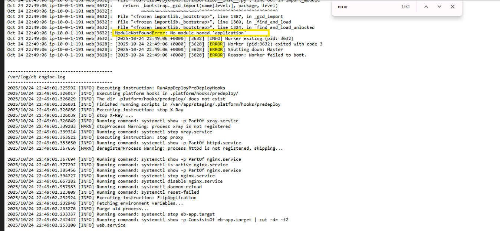

# 12WeeksAWSChallenge-Week2-compute
Week 2 of 12 Weeks of AWS Challenge: Deploying a scalable frontend-backend architecture using AWS Elastic Beanstalk with proper networking, private/public subnets, and multi-tier deployment."
Absolutely! Here's a **summarized and polished version** of your README with a **new title**, keeping the core concept intact but making it shorter, more digestible, and recruiter-friendly:

---

# Deploying a Scalable Frontend-Backend Architecture with AWS Elastic Beanstalk

## Overview

In this project, we explore **AWS Elastic Beanstalk (EB)** and how it simplifies deployment of web applications by automatically managing infrastructure. We'll build a **two-tier architecture**:

* **Backend:** Flask API in a **private subnet**
* **Frontend:** Flask web app in a **public subnet**, connected securely to the backend

By the end, you'll understand:

* EB's architecture and automated resource provisioning
* How to structure and deploy frontend and backend apps
* Networking best practices (public vs private subnets)
* Common troubleshooting steps

---

## Architecture

Elastic Beanstalk automates provisioning of:

* **EC2** for compute
* **Auto Scaling Groups** for high availability
* **Elastic Load Balancers** for traffic distribution
* **S3** for storing app versions
* **CloudWatch** for monitoring

### Custom Setup

* **Frontend:** Public subnet, internet-facing
* **Backend:** Private subnet, internal API
* **Security Groups:** Frontend allows public access, Backend allows access only from Frontend


This diagram illustrates the two-tier Elastic Beanstalk setup — the frontend hosted in a public subnet and the backend deployed in a private subnet, both communicating securely through an internal load balancer.

## Project Structure

  
*Screenshot showing the VS Code folder structure for the project — separating frontend and backend applications for independent Elastic Beanstalk deployments.*


```
12WEEKSAWSCHALLENGE-WK2/
│
├── backend/
│   ├── application.py
│   ├── requirements.txt
│   └── Procfile
│
└── frontend/
    ├── application.py
    ├── templates/index.html
    ├── requirements.txt
    └── Procfile
```

---

## Backend Setup (Private API)

**application.py**

```python
from flask import Flask, jsonify
application = Flask(__name__)

@application.route('/')
def home():
    return jsonify({"message": "Hello from Backend!"})

@application.route('/data')
def data():
    return jsonify({"users": ["IT_Sammy", "Samuel", "Paula"], "message": "Backend running smoothly"})
    
if __name__ == '__main__':
    application.run(host='0.0.0.0', port=8080)
```

**requirements.txt**

```
Flask==3.0.2
flask-cors==4.0.0
gunicorn==21.2.0
```

**Procfile**

```
web: gunicorn application:application
```

**Deploy:** Zip and upload to EB as **private/internal environment**

---

## Frontend Setup (Public Web App)

**application.py**

```python
from flask import Flask, render_template
import requests

application = Flask(__name__)
BACKEND_URL = "http://internal-backend-env.abcdefg.elb.amazonaws.com/data"

@application.route('/')
def home():
    try:
        data = requests.get(BACKEND_URL).json()
    except:
        data = {"error": "Backend unreachable"}
    return render_template('index.html', data=data)

if __name__ == '__main__':
    application.run(host='0.0.0.0', port=8080)
```

**index.html** – Simple frontend displaying backend data.

**requirements.txt**

```
Flask==3.0.2
gunicorn==21.2.0
requests==2.32.3
```

**Procfile**

```
web: gunicorn application:application
```

**Deploy:** Zip and upload to EB as **public environment**

---

## 🚀 Deploying Frontend and Backend Environments on AWS Elastic Beanstalk

We’ll create **two separate environments** under one Elastic Beanstalk application:
- **Backend environment** → private subnet, internal ALB, Docker platform.
- **Frontend environment** → public subnet, internet-facing ALB, Docker platform.

Both will use Elastic Beanstalk’s **Container (Docker)** compute configuration.

---

## 🧱 BACKEND ENVIRONMENT SETUP

### 1️⃣ Create Application
1. Go to **Elastic Beanstalk Console** → **Create Application**.  
2. Name it 
3. Description: `Backend and Frontend app on Elastic Beanstalk`.  
4. Click **Create**.
  
*This screenshot displays the Elastic Beanstalk console during environment configuration — the stage where you set up environment type, network settings, and compute platform.*
---

### 2️⃣ Create Backend Environment
1. Under your app → click **Create Environment**.  
  
*This image shows the "Environment Information" section, where you specify environment name, domain, and description for clarity and easy identification in multi-environment projects.*

2. Choose **Web Server Environment**.  
3. Platform: **Docker** (Amazon Linux 2).  
  
*This screenshot highlights the platform selection menu, where you choose the technology stack your application will run on (in this case, Docker on Amazon Linux 2).*

4. Upload the backend deployment package (e.g., `backend-deploy.zip`).
  
*This image shows the platform version and configuration details page — confirming Docker as the selected compute environment for both frontend and backend deployments.*

---

### 3️⃣ Configure IAM Roles
Elastic Beanstalk will ask for:
- **Service Role**
- **EC2 Instance Role**

If not available, create them:

#### 🛠️ Service Role — `aws-elasticbeanstalk-service-role`
- Go to **IAM → Roles → Create role**.  
- Use **AWS Service → Elastic Beanstalk**.  
- Attach:
  - `AWSElasticBeanstalkService`
  - `AWSElasticBeanstalkEnhancedHealth`
- Name: `aws-elasticbeanstalk-service-role`.

  
*This screenshot shows the stage where Elastic Beanstalk requires a service role to manage AWS resources on your behalf. If one doesn’t exist, you’ll create it manually in IAM.*

  
*Step 1 — Navigate to the IAM console and start creating a new role. Select **Elastic Beanstalk** as the trusted service to allow Beanstalk to assume this role.*

  
*Step 2 — Attach the required managed policies such as `AWSElasticBeanstalkService` and `AWSElasticBeanstalkEnhancedHealth`, which grant Elastic Beanstalk permissions to manage environments and monitor health.*

#### 🧩 EC2 Instance Role — `aws-elasticbeanstalk-ec2-role`
- Go to **IAM → Roles → Create role**.  
- Choose **EC2** as trusted entity.  
- Attach:
  - `AmazonS3ReadOnlyAccess`
  - `CloudWatchLogsFullAccess`
  - `AmazonSSMManagedInstanceCore` *(optional but recommended)*  
- Name it `aws-elasticbeanstalk-ec2-role`.
  
*Step 1 — Begin creating the EC2 instance role from the IAM console. This role allows Elastic Beanstalk EC2 instances to access necessary AWS resources like S3, CloudWatch, and SSM.*

  
*Step 2 — Select **EC2** as the trusted entity, granting permissions specifically for EC2 instances launched by Elastic Beanstalk.*

  
*Step 3 — Attach key policies such as `AmazonS3ReadOnlyAccess`, `CloudWatchLogsFullAccess`, and `AmazonSSMManagedInstanceCore` (optional but recommended for remote access via Systems Manager).*


Then return to Beanstalk:
- Under **Service Role**, select `aws-elasticbeanstalk-service-role`.  
- Under **EC2 Instance Profile**, select `aws-elasticbeanstalk-ec2-role`.
  
*Step 4 — Review and finalize the EC2 instance role creation, naming it `aws-elasticbeanstalk-ec2-role`. This role ensures Elastic Beanstalk instances can pull code, write logs, and report*
---

### 4️⃣ Network Configuration
- **VPC**: Select your project’s VPC.
- **Subnets**: Choose **private subnets** for both EC2 and Load Balancer.
- **Load Balancer**: Internal (not internet-facing).


Ensure **NAT Gateway** is configured in your VPC for backend outbound internet access.

---

### 5️⃣ Compute Configuration
For this project, keep the **default Docker container compute type**:

| Setting | Value |
|----------|--------|
| **Compute Type** | Container (Docker) |
| **Instance Type** | t3.micro |
| **Platform Branch** | Docker running on Amazon Linux 2 |
| **Auto Scaling** | Min = 1, Max = 2 |
| **Health Reporting** | Enhanced |

Elastic Beanstalk automatically provisions EC2 instances with Docker installed and runs your `Dockerfile` or `Dockerrun.aws.json` to launch the container.

---

### 6️⃣ Security Groups
| Security Group | Purpose | Rules |
|----------------|----------|--------|
| **SG-Backend** | Backend EC2 & ALB | Inbound: Allow HTTP (8080) from Frontend SG only |

Ensure **no inbound from 0.0.0.0/0** to maintain backend privacy.

---

### 7️⃣ Review and Create
Before launching:
- Service Role: ✅ `aws-elasticbeanstalk-service-role`
- EC2 Role: ✅ `aws-elasticbeanstalk-ec2-role`
- Compute Type: ✅ Container (Docker)
- VPC/Subnet: ✅ Private
- Load Balancer: ✅ Internal
- Health Check: ✅ `/`
- Security Group: ✅ SG-Backend only

Click **Create Environment**.  
Wait for status to turn **Health: Green**.  
Copy the **internal ALB DNS** — you’ll need it for the frontend.

---

## 🌐 FRONTEND ENVIRONMENT SETUP

### 1️⃣ Create Frontend Environment
1. Back in the same Elastic Beanstalk application, click **Create Environment** again.  
2. Choose **Web Server Environment**.  
3. Platform: **Docker** (Amazon Linux 2).  
4. Upload `frontend-deploy.zip`.
  
*This screenshot shows the initial stage of creating the **frontend environment** in Elastic Beanstalk — where you define environment type and configuration scope within your existing application.*

  
*This image highlights the **Application Information** section, where you provide a descriptive environment name and domain for your frontend web app.*

  
*This screenshot shows the **Platform selection** stage — Docker is chosen here as the compute platform to containerize and deploy the frontend application seamlessly.*

  
*This image represents the **Application Code** upload step, where the frontend deployment package (e.g., `frontend-deploy.zip`) is uploaded to Elastic Beanstalk for provisioning.*


---

### 2️⃣ Configure IAM Roles
Use the same:
- **Service Role:** `aws-elasticbeanstalk-service-role`
- **EC2 Instance Profile:** `aws-elasticbeanstalk-ec2-role`
  
*This screenshot captures the **Service Role configuration** section, where you assign the previously created `aws-elasticbeanstalk-service-role` and `aws-elasticbeanstalk-ec2-role` to grant Elastic Beanstalk necessary management permissions.*
---

### 3️⃣ Network Configuration
- **VPC:** Same as backend.  
- **Subnets:** Choose **public subnets**.  
- **Load Balancer Scheme:** Internet-facing.

| Component | Type | Purpose |
|------------|------|----------|
| EC2 Instance | Public subnet | Hosts the frontend app |
| Load Balancer | Internet-facing | Allows public web access |

  
*This image shows the **Networking and VPC** configuration, where you attach the frontend environment to the correct VPC, select public subnets, and configure load balancer access for internet-facing traffic.*
---

### 4️⃣ Compute Configuration
Same as backend:
| Setting | Value |
|----------|--------|
| **Compute Type** | Container (Docker) |
| **Instance Type** | t3.micro |
| **Auto Scaling** | Min = 1, Max = 2 |
  
*This screenshot demonstrates the **Instance, Traffic, and Scaling** setup, where you define instance type, auto scaling rules, and load balancer behavior to ensure the frontend remains responsive under varying traffic loads.*

---

### 5️⃣ Security Groups
| Security Group | Purpose | Rules |
|----------------|----------|--------|
| **SG-Frontend** | Frontend EC2 & ALB | Inbound: HTTP (80) and HTTPS (443) from anywhere (0.0.0.0/0) |
| **Outbound** | All | Allows calling backend ALB internally |

---

### 6️⃣ Software Configuration
After backend is deployed:
1. Copy backend’s **internal ALB DNS name** (e.g. `internal-backend-env.abcdefg.elb.amazonaws.com`).  
2. Go to **Frontend → Configuration → Software → Environment Properties**.  
3. Add:BACKEND_URL=http://internal-backend-env.abcdefg.elb.amazonaws.com/data

4. Click **Apply Changes** → Beanstalk will redeploy.

This makes your frontend call the backend through the internal ALB (private communication inside VPC).

---

### 7️⃣ Review and Create
Before launching:
- Service Role: ✅ `aws-elasticbeanstalk-service-role`
- EC2 Role: ✅ `aws-elasticbeanstalk-ec2-role`
- Compute Type: ✅ Container (Docker)
- VPC/Subnets: ✅ Public
- Load Balancer: ✅ Internet-facing
- Environment Variable: ✅ `BACKEND_URL`
- Security Group: ✅ SG-Frontend (allow HTTP/HTTPS)

Click **Create Environment**.  
Wait until **Health = Green**.

---

## Connecting Frontend and Backend

1. Copy backend internal ALB DNS
2. EB Console → Frontend → Configuration → Software → Environment Properties
3. Add: `BACKEND_URL=http://internal-backend-env.abcdefg.elb.amazonaws.com/data`
4. Apply changes & redeploy
Alternatively, you can identify and copy the **frontend environment URL** directly from the Elastic Beanstalk console.  
Simply open the URL in your browser to verify that your frontend is live and successfully communicating with the backend.

  
*This section shows the live URL of the deployed frontend environment on Elastic Beanstalk — the publicly accessible endpoint used to verify the full-stack deployment.*


  
*This screenshot displays the frontend application successfully fetching and displaying data from the backend API, confirming secure communication between both Elastic Beanstalk environments.*

---

## Troubleshooting

* **502 Bad Gateway:** Check Procfile, gunicorn in requirements.txt, ZIP structure
  
*This screenshot shows the "502 Bad Gateway" error that may occur when the Elastic Beanstalk environment encounters deployment or configuration issues — such as an incorrect Procfile,*

* **ModuleNotFoundError:** Ensure Procfile points to correct Flask instance
  
*This screenshot captures the "ModuleNotFoundError" indicating that Elastic Beanstalk could not locate the specified Flask application module — often caused by incorrect Procfile configuration or mismatched app variable names.*
  
*This screenshot highlights the correct Procfile format — `web: gunicorn application:application` — which ensures Elastic Beanstalk correctly identifies and runs the Flask app, preventing `ModuleNotFoundError` issues during deployment.*

* **Frontend cannot reach Backend:** Confirm backend in private subnet, security groups allow access, and correct internal ALB URL used

---
## What I Learned (STAR Format)

**Situation:**  
In Week 2 of my *12 Weeks of AWS Challenge*, I set out to understand how AWS Elastic Beanstalk operates beneath its “easy deployment” layer by building a real-world two-tier application — a Flask-based backend and a Flask-based frontend — deployed across private and public subnets.

**Task:**  
My goal was to explore how Elastic Beanstalk automatically provisions and manages infrastructure components such as EC2 instances, Load Balancers, Auto Scaling Groups, and networking, while still giving developers control over configurations.

**Action:**  
I created and deployed two separate Elastic Beanstalk environments — one for the backend API and one for the frontend interface. I configured IAM roles, defined a secure VPC architecture, attached NAT and Internet Gateways, and set environment variables to securely connect both applications. During deployment, I encountered common errors like `502 Bad Gateway` and `ModuleNotFoundError`, which I resolved by reviewing the `Procfile` setup and dependency files (`requirements.txt`).

**Result:**  
By the end of this challenge, I successfully deployed a fully functional, scalable, and secure two-tier application. I gained hands-on experience with Elastic Beanstalk’s internal automation, networking configuration, and debugging process — skills directly applicable to designing production-ready cloud architectures.

---

## Next Challenge – Week 3 (Forward-Looking Plan)

**Situation:**  
With the foundational compute and networking concepts from Week 2 established, I’m moving into more advanced AWS networking practices.

**Task:**  
The objective for Week 3 is to design a **secure access architecture** that enables administrators to manage private instances safely while maintaining strict network isolation.

**Action Plan:**  
- Set up a **Bastion Host** in a public subnet for secure SSH access.  
- Configure private subnets so internal instances remain inaccessible from the internet.  
- Use **security groups**, **route tables**, and **network ACLs** to control inbound and outbound traffic.  
- Demonstrate how a Bastion Host facilitates secure management workflows within AWS environments.  

**Expected Result:**  
By the end of Week 3, I’ll have implemented a **secure networking model** that mirrors industry best practices — reinforcing my understanding of **network segmentation, access control, and operational security** in AWS environments.

---


